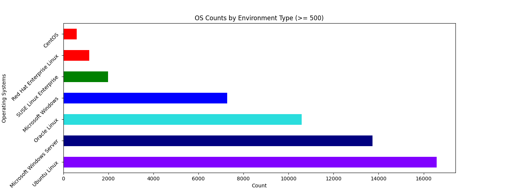
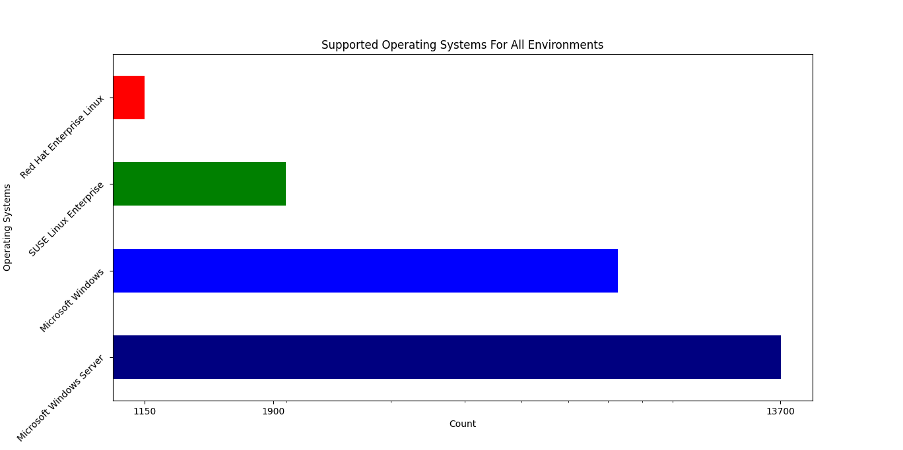
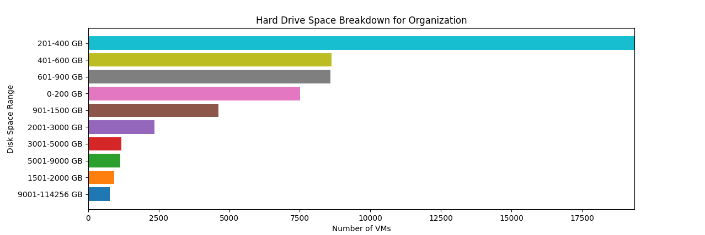

# vminfo_parser

**vminfo_parser** is a command-line tool to help you process and analyze virtual machine (VM) data from CSV or Excel files. The tool reads your raw inventory data, normalizes the information, and produces useful reports such as operating system counts, disk space distributions, and per-site resource usage. For users who prefer graphical output over plain text tables, you can enable visual graphs with a simple flag. 

## Features

- **Flexible Input:** Accepts a single file or a directory of spreadsheets/csv files
- **Dynamic Reporting:** Generates reports on operating system counts, disk space ranges, VM resource usage by site, and more.
- **Graphical Output:** With an option, you can generate graphs (bar charts, pie charts, etc.) to visually interpret your data.
- **Environment Categorization:** Easily separate production from non-production data by providing your environment labels.
- **YAML Configuration:** Save and reuse your favorite command-line options by generating a YAML file.

## Installation

vminfo_parser can be installed with pip, or executed directly from a cloned repo.

### pip

```
pip3 install git+https://github.com/rhtools/vminfo-parser.git

vminfo-parser --help
```

### pip - versioned

```
pip3 install git+https://github.com/rhtools/vminfo-parser.git@v1.0.0

vminfo-parser --help
```

### git repo

```
git clone https://github.com/rhtools/vminfo-parser.git

cd vminfo-parser
pip3 install requirements.txt
python3 -m vminfo_parser --help
```

### Updating With Pip
If you have created a virtual env and installed the `vminfo-parser`, you can update your `pip` environment by activating your virtualenv:

```
source </path/to/venv>
```

 and then cloning the repository:

 ```
git clone https://github.com/rhtools/vminfo-parser
cd vminfo-parser
git checkout dev
 ```

 Finally you can install the latest code by typing
 ```
pip install -e .
 ```


## Input File Format

VMInfo Parser accepts CSV and Excel files containing VM inventory data. The tool is designed to be flexible and can adapt to different column naming conventions. It automatically detects file encoding and CSV delimiters.

The parser expects the following information (though column names may vary):
- VM name
- Operating system information
- Memory allocation
- Disk space allocation
- Environment information (e.g., production, development)
- CPU count

Currently supported headers:

```
"VERSION_1":
    {
        "operatingSystemFromVMTools": "VM OS",
        "operatingSystemFromVMConfig": "VM OS",
        "environment": "Environment",
        "vmMemory": "VM MEM (GB)",
        "vmDisk": "VM Provisioned (GB)",
        "vCPU": "VM CPU",
    }

"VERSION_2": 
    {
        "operatingSystemFromVMConfig": "OS according to the configuration file",
        "operatingSystemFromVMTools": "OS according to the VMware Tools",
        "environment": "Environment",
        "vmMemory": "Memory",
        "vmDisk": "Provisioned MiB",
        "vCPU": "CPUs",
    }

"VERSION_3": 
    {
        "operatingSystemFromVMConfig": "OS according to the configuration file",
        "operatingSystemFromVMTools": "OS according to the VMware Tools",
        "environment": "ent-env",
        "vmMemory": "Memory",
        "vmDisk": "Total disk capacity MiB",
        "vCPU": "CPUs",
    }
```

## Usage


| Option                       | Description                                                                                                                                   | Relevant Method/Location                                    |
|------------------------------|-----------------------------------------------------------------------------------------------------------------------------------------------|-------------------------------------------------------------|
| `--breakdown-by-terabyte`    | Breaks disk space into ranges of 0–2 TiB, 2–9 TiB, and 9+ TiB instead of the default categories.                                              | `Analyzer.generate_dynamic_ranges`                      |
| `--directory`                | Specifies the directory containing CSV or Excel files to process.                                                                            | `VMData.from_file` in `vmdata.py`                      |
| `--disk-space-by-granular-os` | Provides a more granular disk space breakdown by operating system.                                                                             | `Analyzer.sort_by_disk_space_range`                       |
| `--file`                     | Specifies the CSV or Excel file containing VM data to parse.                                                                                 | `VMData.from_file` in `vmdata.py`                      |
| `--generate-graphs`          | Enables graphical output to display visual graphs instead of just text-based tables.                                                         | `Visualizer` functions via the `plotter` decorator     |
| `--generate-yaml`            | Generates a YAML configuration file with all available parser options.                                                                       | `Config.generate_yaml_from_parser` in `config.py`      |
| `--get-disk-space-ranges`    | Generates a report showing the distribution of disk space across VMs.                                                                          | `get_disk_space_ranges` function in `main.py`          |
| `--get-os-counts`            | Outputs a report with a count of VMs per operating system.                                                                                   | `get_os_counts` function in `main.py`                  |
| `--get-supported-os`         | Displays counts (and graph if enabled) for supported operating systems (for OpenShift Virt).                                                   | `get_supported_os` function in `main.py`                  |
| `--get-unsupported-os`       | Displays counts (and graph if enabled) for unsupported operating systems.                                                                    | `get_unsupported_os` function in `main.py`                |
| `--minimum-count`            | Excludes operating system entries that have counts below the specified threshold.                                                            | `Analyzer._calculate_os_counts` in `analyzer.py`           |
| `--os-name`                  | Filters reports to include only the specified operating system.                                                                              | `Analyzer.get_disk_space` in `analyzer.py`                |
| `--over-under-tb`            | Provides a simple breakdown separating machines under 1 TiB from those over 1 TiB.                                                             | `Analyzer.generate_dynamic_ranges`                      |
| `--output-os-by-version`     | Outputs a detailed breakdown of operating system versions for a given OS.                                                                    | `output_os_by_version` function in `main.py`              |
| `--prod-env-labels`          | Specifies production environment labels (CSV format) to distinguish between prod and non-prod data.                                          | Used in `VMData._categorize_environment` in `vmdata.py`     |
| `--show-disk-space-by-os`      | Generates disk space reports grouped by operating system.                                                                                    | `show_disk_space_by_os` function in `main.py`[4]             |
| `--sort-by-env`              | Sorts VM data based on the environment. Accepts values such as "all", "both", or a specific environment.                                       | `VMData.create_environment_filtered_dataframe`          |
| `--sort-by-site`             | Generates per-site statistics for resource usage (memory, CPU, disk) across VMs.                                                             | `sort_by_site` function in `main.py`                      |
| `--yaml`                     | Reads a YAML configuration file containing all option values instead of using individual command-line flags.                                   | `Config._load_yaml` in `config.py`                        |


This program can be used either by passing in a combination of flags or by using a YAML file with the options set within.

For convenience, there is a `--generate-yaml` flag which will generate a YAML file with all of the possible arguments set to their default. If you want to capture all of the options that you pass into the program for future usage you can use the program with all of the flags you required and then append `--generate-yaml`.

> [!NOTE]
> If you use the `--generate-yaml` the program will not actually process data, it will simply generate a YAML file with either default or overridden options!

`--yaml` and `--file` are mutually exclusive and only one option should be used. It is assumed that if you are passing in a `--file` that you will want to pass in all the required arguments to the program via flags.

## Examples

The repository includes sample datasets in the `tests/files/` directory. You can use these to test the tool's functionality without needing your own data:

```bash
vminfo-parser --file tests/files/Test_Inventory_VMs.csv --get-os-counts --generate-graphs
```

### Get OS Counts

```sh
vminfo-parser --file tests/files/Test_Inventory_VMs.csv --get-os-counts --generate-graphs

OS Name
Ubuntu Linux                16583
Microsoft Windows Server    13732
Oracle Linux                10589
Microsoft Windows            7280
SUSE Linux Enterprise        1991
Red Hat Enterprise Linux     1150
CentOS                        592
```



### Get Supported OS
```sh
vminfo_parser --file tests/files/Test_Inventory_VMs.csv --generate-graphs  --sort-by-env "all" --prod-env-labels Prod-DC1,Prod-DC2 --get-supported-os     

OS Name
Microsoft Windows Server    13732
Microsoft Windows            7280
SUSE Linux Enterprise        1991
Red Hat Enterprise Linux     1150
```



### Get Disk Space Ranges

```sh
vminfo_parser --file tests/files/Test_Inventory_VMs.csv --generate-graphs  --get-disk-space-ranges --sort-by-env "all" --prod-env-labels Prod-DC1,Prod-DC2

Count                                  
Disk Space Range    Count            
0-200 GiB           7519             
201-400 GiB         19361            
401-600 GiB         8619             
601-900 GiB         8584             
901-1500 GiB        4620             
1501-2000 GiB       921              
2001-3000 GiB       2358             
3001-5000 GiB       1176             
5001-9000 GiB       1138             
9001-114256 GiB     773
```




### Generate YAML of All Options

```bash
vminfo-parser --file tests/files/Test_Inventory_VMs.csv --generate-yaml 
```

This command creates a YAML file listing every available option with the default values. The file can then be tweaked for future runs.

## Contributing

Contributions to VMInfo Parser are welcome! The codebase is organized into modules:
- `vmdata.py`: Handles data loading and normalization
- `analyzer.py`: Performs data analysis
- `visualizer.py`: Creates visualizations
- `clioutput.py`: Manages terminal output
- `config.py`: Handles configuration
- `main.py`: Entry point and workflow coordination

